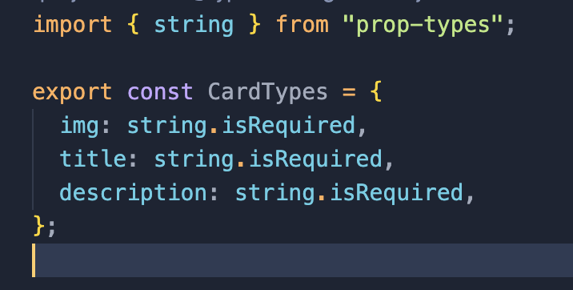
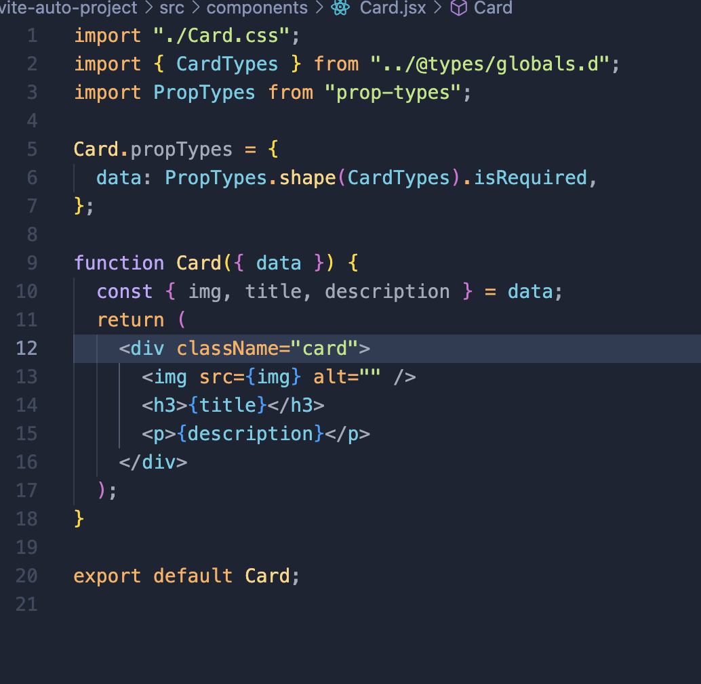
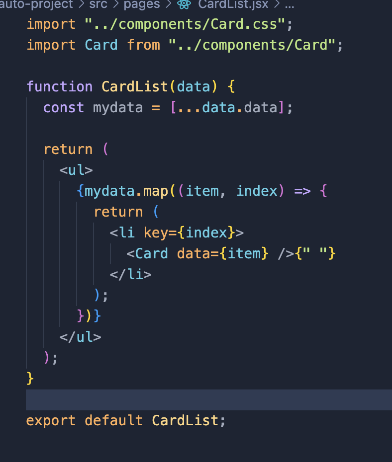

- 카드 컴포넌트 만들기
  

저번주 과제 말고 새로운 컴포넌트를 만들어보았다.
이번엔 카드 컴포넌트이고, Porps 로 이미지 `url,title,descripton` 을 전달할수 있도록 하였다.

해당 프롭스들의 타입을 정해주고, 필수로 정해주었다.

카드컴포넌트의 프롭타입을 @types 폴더 내에 미리 정의해둔 파일로 설정하고 필수로 필요하다고 설정해주었다.

카드 리스트 컴포넌트에 카드 컴포넌트를 뿌려려고, 데이터를 가져와 복사합니다.이 줄에서 data.data는 CardList 컴포넌트에 전달된 data라는 이름의 prop에 접근하고 있습니다.

첫 번째 data는 컴포넌트에 전달된 props 객체 전체를 나타냅니다.
두 번째 .data는 그 props 객체 내의 data라는 이름의 특정 prop을 가리킵니다.

커스텀 환경설정을하다가 도저히 못하겠어서 오토스케폴딩 하였습니다..

타입스크립트를 공부해서, 타입검사를 타입스크립트로 해보고싶다는 생각이 들었습니다.
