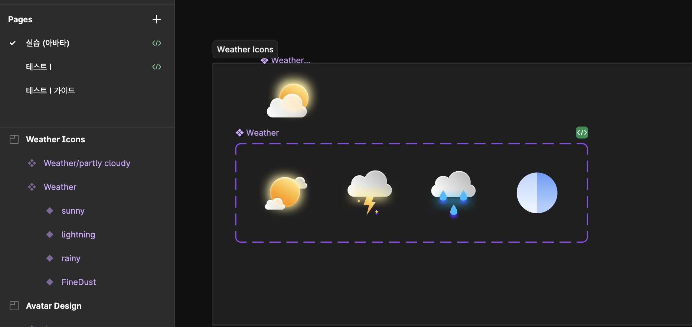

- 날씨 아이콘 에 status를 줘서 한개의 컴포넌트로 상태를 변경할수 있도록 설계하였습니다.

- Weather 의 Props 의 타입값을 설정해주었습니다.

- size 두개의 props 를 도무 기본값을 설정해주었습니다.

이번 과제를 통해 jsx 문법의 편리함을 알았습니다.
다른 예재는 jsx 를 사용하지 않는 방법과 사용하는 방법으로 하나의 컴포넌트를 만들어볼 생각입니다.

[피그마시안](<https://www.figma.com/design/1infWh3Uc24gFfiHZMBm80/%EB%94%94%EC%9E%90%EC%9D%B8-%E2%86%92-%EA%B0%9C%EB%B0%9C-%ED%95%B8%EB%93%9C%EC%98%A4%ED%94%84-(Copy)?node-id=215-18&m=dev&t=1VNhtavueQSavc1j-1>)

[깃헙주소](https://github.com/Gomyeunghan/Practice-React/tree/main/vite-project)
